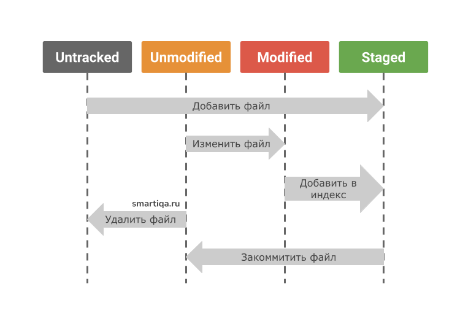
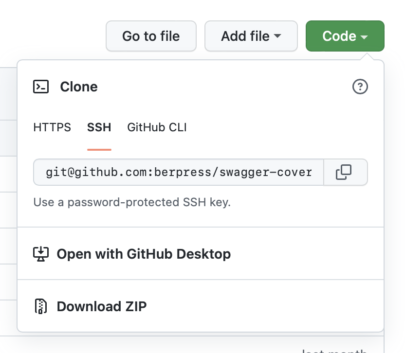

# GIT
GIT start

Инструкция - https://git-scm.com/book/ru/v2




### С чего начать ?
#### Настройка

1) Добавим своем имя и почту. Таким образом, пользователи всегда будут в курсе, кто отвечает за какие изменения.
```
git config --global user.name "name"
git config --global user.email mail@example.com
```

2) Скачиваем ваш проект. Открываем проект -> выбираем SSH -> copy


И выполняем 

```
git clone git@github.com:berpress/GIT.git
```

4) Но перед работой нам необходимо настроить доступ к репозиторию по ssh (иначе мы не сможем заливать изменения).
Необходимо добавить ssh ключ. 

Инструкция https://docs.github.com/en/authentication/connecting-to-github-with-ssh/generating-a-new-ssh-key-and-adding-it-to-the-ssh-agent

4) Начинаем работать. Проверяем состояние. 
status — это еще одна важнейшая команда, которая показывает информацию о текущем состоянии репозитория: актуальна ли информация на нём, нет ли чего-то нового, что поменялось, и так далее

Пример:
```
git status
На ветке main
Ваша ветка обновлена в соответствии с «origin/main».

Изменения, которые не в индексе для коммита:
  (используйте «git add <файл>…», чтобы добавить файл в индекс)
  (используйте «git restore <файл>…», чтобы отменить изменения в рабочем каталоге)
        изменено:      README.md

Неотслеживаемые файлы:
  (используйте «git add <файл>…», чтобы добавить в то, что будет включено в коммит)
        .DS_Store
        .idea/
        images/

нет изменений добавленных для коммита

```
Этой командой вы будете пользоваться чаще всего 

Сейчас мы находимся на ветке **main**. Переключимся на новую ветку

```python
git checkout -b my-branch
```
Проверяем, что успешно переключились 
```
❯ git status
На ветке my-branch
...
```

Редактируем или добавляем новые файлы. Теперь добавим их! Сначала проверим, какие файлы у нас готовы для коммита
```
git status
На ветке my-branch
Изменения, которые не в индексе для коммита:
  (используйте «git add <файл>…», чтобы добавить файл в индекс)
  (используйте «git restore <файл>…», чтобы отменить изменения в рабочем каталоге)
        изменено:      README.md

```

Добавим файл Readme.md

```
git add README.md
```

Проверим статус

```
git status
На ветке my-branch
Изменения, которые будут включены в коммит:
  (используйте «git restore --staged <файл>…», чтобы убрать из индекса)
        изменено:      README.md

```

Файл успешно добавлен! Теперь осталось выполнить коммит 

```
git commit -m "Add Readme.md"
[my-branch f47f095] Add Readme.md
1 file changed, 93 insertions(+)
```
Флажок -m задаст commit message - комментарий разработчика. Он необходим для описания закоммиченных изменений.

Теперь осталось отправить изменения на сервер 

```
git push origin main
```

Результат 
```
Перечисление объектов: 5, готово.
Подсчет объектов: 100% (5/5), готово.
При сжатии изменений используется до 16 потоков
Сжатие объектов: 100% (2/2), готово.
Запись объектов: 100% (3/3), 1.61 КиБ | 1.61 МиБ/с, готово.
Всего 3 (изменений 0), повторно использовано 0 (изменений 0), повторно использовано пакетов 0
remote: 
remote: Create a pull request for 'my-branch' on GitHub by visiting:
remote:      https://github.com/berpress/GIT/pull/new/my-branch
remote: 
To github.com:berpress/GIT.git
 * [new branch]      my-branch -> my-branch
Ветка «my-branch» отслеживает внешнюю ветку «my-branch» из «origin».

```

Все получилось, наши файлы ушли на сервер! Теперь осталось создать MR (в GitHub или GitLab) и отправить его на ревью.

### Полезные команды

* **git log** Просматривать изменения, внесённые в репозиторий, можно с помощью параметра log. Он отображает список последних коммитов в порядке выполнения.
* **git diff (--staged or file)** Можно просматривать список изменений, внесённых в репозиторий
* **git rm dirname/somefile.js** Удалять файлы из текущего рабочего дерева
* **git checkout somefile.js** Восстановить файлы рабочего дерева, не подготовленные к коммиту
* **git reset HEAD somefile.js** Восстановить подготовленный файл рабочего дерева
* **git commit --amend -m "Updated message for the previous commit"** Внести изменения в последний коммит
* **git branch** Можно просматривать полный список веток
* **git merge existing_branch_name** Объединить две ветки можно параметром merge с указанием имени ветки. Команда объединит указанную ветку с основной.
* **git pull** Для загрузки изменений из удалённого репозитория
* **git merge origin** Слияние удалённого репозитория с локальным
* **git stash** Cохраняет неподтвержденные изменения 
* **git stash apply** Применение ранее отложенных изменений
* **git fetch** собирает все коммиты из целевой ветки, которых нет в текущей ветке, и сохраняет их в локальном репозитории. Однако он не сливает их в текущую ветку.


